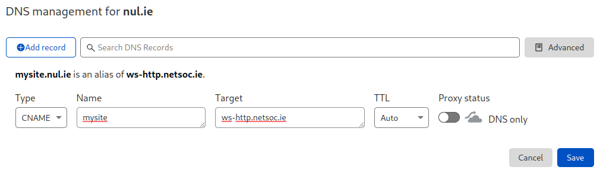

# Custom domains

Next-gen webspaces support custom domains! This means you can access your
webspace at `https://mydomain.com` (for example) as well as
`https://myusername.ng.netsoc.ie`.

## DNS configuration

In order to point your domain at Netsoc's servers (and therefore your
webspace!), you'll need to make some DNS configuration changes. The exact
process will vary from provider to provider, but the records needed will be the
same. In this guide we'll use [Cloudflare](https://www.cloudflare.com/)
(which can be configured for almost any domain registrar).

!!! warning
    Depending on your setup, it can take up to 24 hours for changes to DNS to
    propagate.

### CNAME record

The main DNS record you'll need is a `CNAME` or "alias" record. This makes sure
that any requests to your domain are routed to Netsoc's servers. The target for
the `CNAME` record should be `webspaced.netsoc.ie`. See below for an example:

!!! note
    If you're using Cloudflare, click the cloud icon to disable proxying, it's
    not needed with webspaces.

!!! note
    Some DNS providers might not allow you to put a `CNAME` record at the root
    of your domain. In this case, create an `A` record instead with the
    following IP address: `80.111.124.111`. Note that this is unfortunately
    due to change in the future as we upgrade servers.

### TXT record

In order to verify that you own a domain, we also need you to create a `TXT`
record. This should be of the form `webspace:id:123`, where `123` is your user
ID. You can find your user ID by running `netsoc account info`. Example:

