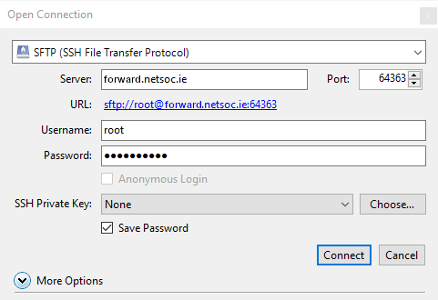

# File transfer

!!! note
    This guide requires you have either set up SSH at webspace creation time or
    afterwards by following the [port forwarding guide](../port_forwarding).

Managing a website often means needing to transfer files to the server hosting
the site. With SSH configured, you can transfer files via SCP or SFTP.

## SCP (Linux / Mac / Windows)

`scp` is a command line tool (like `cp`) to transfer files over SSH. From your
terminal, run it like this:

```bash
scp -P 64363 /path/to/local/file.txt root@myusername.ng.netsoc.ie:/remote/path/
```

Don't forget to change the port based on your configured SSH forwarding port!

### Cyberduck (Mac / Windows)

[Cyberduck](https://cyberduck.io) is a free graphical file transfer client.
Once installed, click the "Open Connection" button and enter your details as
before (be sure to chose the SFTP connection type):



Once connected, you should be able to navigate around your webspace's files (by
default you'll be in `/root`, the `root` user's home directory.) Click the up
arrow in the top right to get to the root directory (`/`). You can then drag
and drop files in / out of your webspace!


