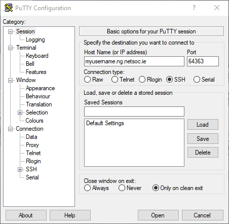
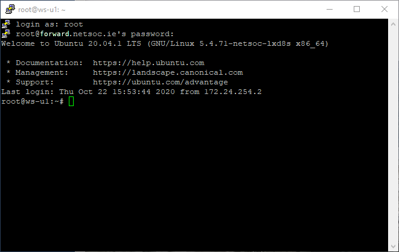

# Port forwarding

While our servers will automatically pass through HTTP connections via a reverse
proxy, what about non-HTTP applications? We have implemented a port forwarding
system to address this.

!!! note
    This guide assumes you did **not** install an SSH server by running
    `netsoc webspace init` with `--ssh`. If you did, SSH with port
    forwarding is already configured. The information regarding managing your
    port forwards is still relevant of course!

## Set up SSH

### Install

In order to make use of a port forward, we need a service to forward a port to!
We'll be using SSH, as it's a very handy way to log in to your webspace and
transfer files. To install the SSH server:

```bash
apt install openssh-server
```

### Enabling password login

After installation, the SSH server will be up and running, but we need to
configure it so that you can log in with your password (set during
`netsoc webspace init`). Run `nano /etc/ssh/sshd_config` to open the config
file in `nano`. Scroll until you see something like the following:

```hl_lines="11"
# Ciphers and keying
#RekeyLimit default none

# Logging
#SyslogFacility AUTH
#LogLevel INFO

# Authentication:

#LoginGraceTime 2m
#PermitRootLogin prohibit-password
#StrictModes yes
#MaxAuthTries 6
#MaxSessions 10

#PubkeyAuthentication yes

# Expect .ssh/authorized_keys2 to be disregarded by default in future.
#AuthorizedKeysFile     .ssh/authorized_keys .ssh/authorized_keys2

#AuthorizedPrincipalsFile none
```

Change `#PermitRootLogin prohibit-password` to `PermitRootLogin yes` (make sure
to remove the `#` at the beginning of the line!). Save the file and exit `nano`.
Run `systemctl reload sshd` to apply the configuration changes.

!!! warning
    Typically, enabling password login for the `root` account is not
    recommended. This is because SSH is usually exposed on a known port (22) and
    it's very easy to write a script that will scan the entire internet and
    brute force weak passwords. In this case, it's not _too_ much of a concern,
    since SSH will be exposed on a random port.

    For improved security, particularly if running SSH on port 22, we recommend
    you look into setting up public key authentication and re-disabling password
    login for `root`!

## Create the port forward

Although the SSH server is up and running, you won't be able to connect to it
remotely. This is because the server isn't exposed to the internet. To create
a port forward, use the `netsoc webspace ports add` command. SSH runs on port
22, so run `netsoc webspace ports add 22`:

```
$ netsoc webspace ports add 22
Port 22 in webspace is now accessible externally via port 64363
$
```

Note the listed external port, which will be random for your webspace.

!!! tip
    If you missed the external port or can't remember it, run
    `netsoc webspace ports` to list all port forwards configured on your
    webspace.

## Log into your webspace via SSH

Now that the port forward is set up, you can use an SSH client to log in to your
webspace! When prompted for a password, enter the same one used with
`netsoc webspace init`.

=== "Linux / macOS"
    Run `ssh root@forward.netsoc.ie` (use your own external port):

    ```
    $ ssh root@forward.netsoc.ie -p 64363
    The authenticity of host '[forward.netsoc.ie]:64363 ([80.111.124.111]:64363)' can't be established.
    ECDSA key fingerprint is SHA256:zB48NdWJQw1ZJztrt5NdTstgdl5Zj0tEuqOjc914zEs.
    Are you sure you want to continue connecting (yes/no/[fingerprint])? yes
    Warning: Permanently added '[forward.netsoc.ie]:64363,[80.111.124.111]:64363' (ECDSA) to the list of known hosts.
    root@forward.netsoc.ie's password:
    Welcome to Ubuntu 20.04.1 LTS (GNU/Linux 5.4.71-netsoc-lxd8s x86_64)

    * Documentation:  https://help.ubuntu.com
    * Management:     https://landscape.canonical.com
    * Support:        https://ubuntu.com/advantage

    The programs included with the Ubuntu system are free software;
    the exact distribution terms for each program are described in the
    individual files in /usr/share/doc/*/copyright.

    Ubuntu comes with ABSOLUTELY NO WARRANTY, to the extent permitted by
    applicable law.

    root@ws-u1:~#
    ```

=== "Windows"
    [PuTTY](https://www.chiark.greenend.org.uk/~sgtatham/putty/latest.html) is
    an SSH client for Windows. You can grab the latest `.exe` for 64-bit
    Windows [here](https://the.earth.li/~sgtatham/putty/latest/w64/putty.exe).

    Enter your details similar to below (use your own external port):

    

    Press "Yes" on the dialog that appears on connnection. When asked for a
    login, enter `root` and your password. You should see something similar to
    the following:

    

!!! tip
    If you've forgotten your webspace password, you can use
    `netsoc webspace exec passwd` to reset it.

## Removing port forwards

You can remove a port forward by running
`netsoc webspace ports remove <external port>`. To find the external port, use
`netsoc webspace ports`.
