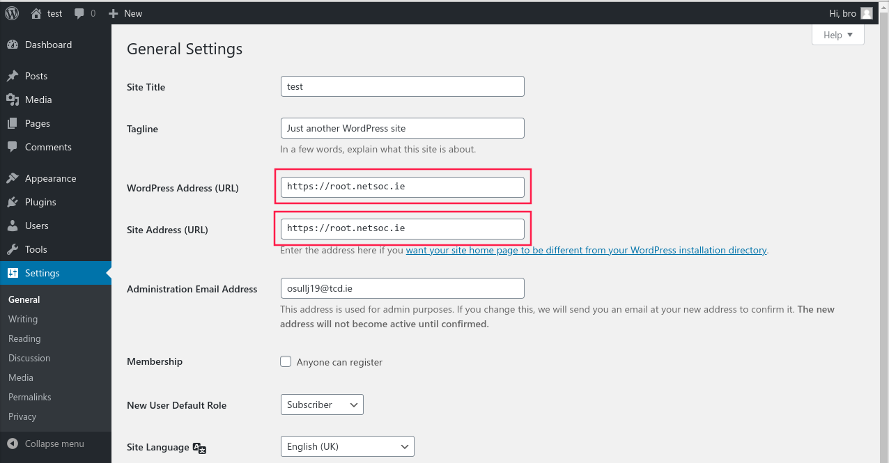

# WordPress

Netsoc provides a ready-made WordPress image! This guide will describe the
installation process and explain how to import an existing WordPress-based
website.

## Installation

Once you've run `netsoc webspace init wordpress` (or a Netsoc sysadmin has done
so for you), simply visit `https://myusername.netsoc.ie` and install WordPress
as usual, that's all there is to it!

## Custom domain

Netsoc hosting supports custom domains. Follow [our guide](../domains/) to add
your domain to your site. Once this is done, you'll need to change your
WordPress settings to use the new domain.

Head to "Settings > General" in your admin panel and set
"**WordPress Address (URL)**", as well as  "**Site Address (URL)**" to
`https://mycustomdomain.com`. Save your changes.

## Import an existing WordPress site

If you'd like to transfer an existing WordPress-based website to Netsoc, the
process is relatively straight forward, although there are a few caveats.
WordPress officially supports exporting and importing, but this only applies to
content on the site, not themes, plugins or configuration. This can be a little
tricky and confusing, so we'll provide a few tips here. Specifically, we're
going to explain importing a WordPress.com site.

### Prepare the new site for importing

There are a few plugins (and themes) you should install before importing your
old site to make sure things go more smoothly. **This advice is specifically for
importing a default WordPress.com sites.**

We recommend you install (and activate!) the following plugins in your new site
before continuing:

- [Layout Grid](https://wordpress.org/plugins/layout-grid/)
- [WordPress.com Editing Toolit](https://en-gb.wordpress.org/plugins/full-site-editing/)
- [CoBlocks](https://wordpress.org/plugins/coblocks/)

At the time of writing, the default theme on WordPress.com sites is "Hever". To
install, first install its parent theme, "[Varia](https://wordpress.com/theme/varia)".
With the zip file downloaded, head to the "Themes" section of the admin panel
(under "Appearance"). Click the "Add New" button and then "Upload Theme". Select
the zip file you just downloaded. Once installed, follow the same steps for the
"[Hever](https://wordpress.com/theme/hever)" theme, then activate the Hever
theme.

### Export the existing site

Approximately following
[this official guide](https://wordpress.com/support/export/), head to your
site's admin panel and head to the export section (as seen on the linked page).
Click "Export All" - a zip file should be created which you can download. This
contains the files needed by the import process later on. You can ignore the
"Exporting the Media Library" section further on in the page.

!!! warning
    As explained in the official export guide, **make sure** your site is public
    before exporting! The import process will pull media files from your old
    site! This also means you shouldn't delete your old site until it has been
    completely imported.

### Import your content

Once you've downloaded the zip file from the export tool, extract it. Then, head
to the admin panel of your new Netsoc WordPress site. To import (based on
[this official guide](https://wordpress.org/support/article/importing-content/#wordpress)):

1. In your WordPress site, select Tools > Import on the left nav of the admin
   screen.
2. Under “WordPress,” if you haven’t already installed the importer, click
   "Install Now."
3. Click the "Run Importer" link.
4. Click "Choose File" and select one of the XML files extracted from the zip
   file downloaded from your exported site
5. Click "Upload file and import."

You should map at least the admin of the old site of posts to the new site's
admin username. Repeat the above steps for each of the XML files in the exported
zip file.

### Tips

As mentioned at the start of this guide, configuration is not imported by
WordPress. This means that theme settings, home pages etc. will not carry
across.

- Some pages might need to have their block sections "recovered" - go to edit
  the page and then click the button to attempt to recover it
- Some pages may also contain content specific to WordPress.com that might need
  to be removed / replaced
