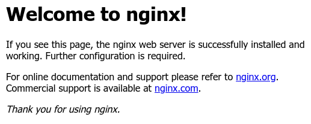
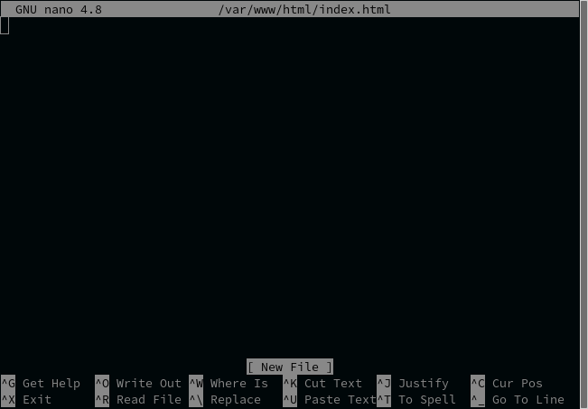
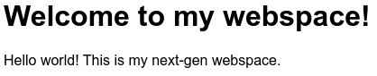

# Introduction

Webspaces allow you to host your website on our servers! Our shiny next-gen
webspaces are based on [LXD](https://linuxcontainers.org/lxd/), which means you
get full root access to a VM-style Linux container!

## Getting started

To set up your webspace, you'll need the Netsoc CLI. See
[our dedicated documentation](/cli/) for more information.

!!! tip
    You can use `netsoc ws` as a shortcut for `netsoc webspace`.

## Create your container

Once the CLI is set up and you're logged in, you can create your webspace
container. First, you'll need to pick an operating system image to install.
(This is similar to other cloud providers like AWS or DigitalOcean). To view a
list of available options, run `netsoc webspace images`:

```bash
$ netsoc webspace images
╭─────────┬──────────────────────────────────────────────┬─────────╮
│ ALIAS  │ DESCRIPTION                              │ SIZE    │
├─────────┼──────────────────────────────────────────────┼─────────┤
│ debian │ Debian buster amd64 (20201008_05:24)     │ 74 MiB  │
│ arch   │ Archlinux current amd64 (20201008_04:18) │ 162 MiB │
│ fedora │ Fedora 32 amd64 (20201007_20:33)         │ 95 MiB  │
│ ubuntu │ Ubuntu focal amd64 (20201006_12:17)      │ 99 MiB  │
│ centos │ Centos 8 amd64 (20201008_07:08)          │ 125 MiB │
│ alpine │ Alpine 3.12 amd64 (20201006_13:00)       │ 2.4 MiB │
╰─────────┴──────────────────────────────────────────────┴─────────╯
$
```

We recommend [Ubuntu](https://ubuntu.com) for beginners, and _it's what we'll
assume you're using in future tutorials_. Generally most of what is shown is
the same or at least very similar across Linux distros.

To create your container:

```bash
netsoc webspace init ubuntu
```

You'll be prompted to enter a password. Note that this is **not** your Netsoc
password! This is a password for the `root` (or admin) user in your container.
It can be whatever you like, most of the time you probably won't need it.

!!! tip
    If you are familiar with SSH and would prefer to use public key
    authentication, you can run
    `netsoc webspace init --ssh-key /path/to/key.pub`. An SSH server will be
    installed along with your public key. A port forward will be created so you
    can connect directly. Otherwise, don't worry! We'll cover SSH in a future
    guide.

After up to about a minute, the command should complete and your webspace will
be initialized!

## Logging in

Now that your container has been created, you can log in! Just run
`netsoc webspace login`. If your container isn't running (which it won't be
initially after creating it), there will be a slight delay as it starts up.
You should see something similar to the following:

```bash
root@ws-u1:~#
```

Congrats! You've now got full root access to your container.

## Website setup

Once logged in, you can set up a web server to serve some pages! We'll use
`nginx`. From your webspace shell, run `apt install nginx`. When prompted with
`Do you want to continue? [Y/n]`, just press enter. You should see something
like this (summarised):

```
root@ws-u1:~# apt install nginx
Reading package lists... Done
Building dependency tree
Reading state information... Done
The following additional packages will be installed:
  fontconfig-config fonts-dejavu-core libfontconfig1 libfreetype6 libgd3 libjbig0 libjpeg-turbo8 libjpeg8 libnginx-mod-http-image-filter libnginx-mod-http-xslt-filter
  libnginx-mod-mail libnginx-mod-stream libpng16-16 libtiff5 libwebp6 libxpm4 libxslt1.1 nginx-common nginx-core
Suggested packages:
  libgd-tools fcgiwrap nginx-doc ssl-cert
The following NEW packages will be installed:
  fontconfig-config fonts-dejavu-core libfontconfig1 libfreetype6 libgd3 libjbig0 libjpeg-turbo8 libjpeg8 libnginx-mod-http-image-filter libnginx-mod-http-xslt-filter
  libnginx-mod-mail libnginx-mod-stream libpng16-16 libtiff5 libwebp6 libxpm4 libxslt1.1 nginx nginx-common nginx-core
0 upgraded, 20 newly installed, 0 to remove and 0 not upgraded.
Need to get 3102 kB of archives.
After this operation, 9603 kB of additional disk space will be used.
Do you want to continue? [Y/n]
Get:1 http://archive.ubuntu.com/ubuntu focal/main amd64 libpng16-16 amd64 1.6.37-2 [179 kB]
...
Get:20 http://archive.ubuntu.com/ubuntu focal-updates/main amd64 nginx all 1.18.0-0ubuntu1 [3624 B]
Fetched 3102 kB in 1s (3908 kB/s)
Preconfiguring packages ...
Selecting previously unselected package libpng16-16:amd64.
(Reading database ... 14661 files and directories currently installed.)
Preparing to unpack .../00-libpng16-16_1.6.37-2_amd64.deb ...
Unpacking libpng16-16:amd64 (1.6.37-2) ...
...
Selecting previously unselected package nginx.
Preparing to unpack .../19-nginx_1.18.0-0ubuntu1_all.deb ...
Unpacking nginx (1.18.0-0ubuntu1) ...
Setting up libxpm4:amd64 (1:3.5.12-1) ...
Setting up nginx-common (1.18.0-0ubuntu1) ...
Created symlink /etc/systemd/system/multi-user.target.wants/nginx.service → /lib/systemd/system/nginx.service.
Setting up libjbig0:amd64 (2.1-3.1build1) ...
...
Setting up nginx (1.18.0-0ubuntu1) ...
Processing triggers for systemd (245.4-4ubuntu3.2) ...
Processing triggers for libc-bin (2.31-0ubuntu9.1) ...
root@ws-u1:~#
```

Now the nginx web server is up and running in your webspace! Visit
`https://myusername.ng.netsoc.ie` and you should see a page like this:



## Website customisation

To make some changes to your site, you'll need a text editor. (We'll show you
how to transfer files to / from your webspace in a future guide.) This text
editor will be terminal based, for beginners we recommend `nano`. To install:

```bash
apt install nano
```

To replace the default nginx webpage, we'll create a new `index.html` file. This
file (and other public HTML, CSS or JavaScript) should live in `/var/www/html`.
Open `nano` with the new `index.html` filename as follows:

```bash
nano /var/www/html/index.html
```

You should now see an interface like this:



Simply type and use the arrow keys to move around. To quit, press `^X` (Ctrl+x,
the `^` means control, even on a Mac). If you've made any changes, a question
`Save modified buffer?` will appear. Press `y`. A new question
`File Name to Write:`, followed by the path to the new `index.html` will follow.
Just press enter since we want to save to the same file that was opened. You can
also use `^O` to save the file without quitting `nano`.

Feel free to write any HTML you like. You can use the following as an example
(paste it into your terminal directly):

```html
<!doctype html>
<html>
  <head>
    <meta charset="utf-8">
    <title>Welcome to my webspace!</title>
    <meta name="description" content="">
    <meta name="viewport" content="width=device-width, initial-scale=1">

    <style>
      body {
        font-family: sans-serif;
      }
    </style>
  </head>

  <body>
    <h1>Welcome to my webspace!</h1>
    <p>Hello world! This is my next-gen webspace.</p>
  </body>
</html>
```

Once your changes have saved, reload your webspace page and you should see
something like this:


